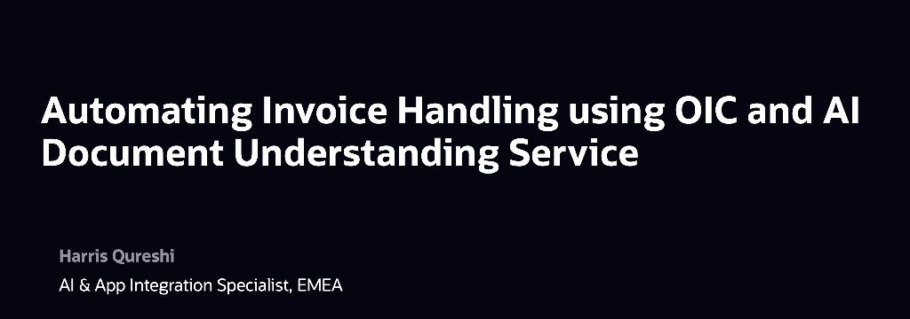
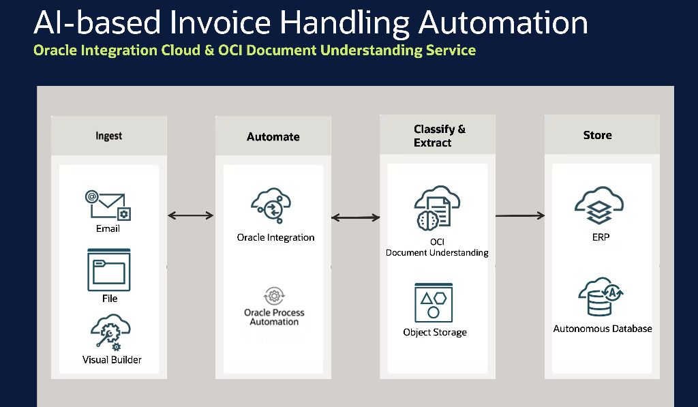
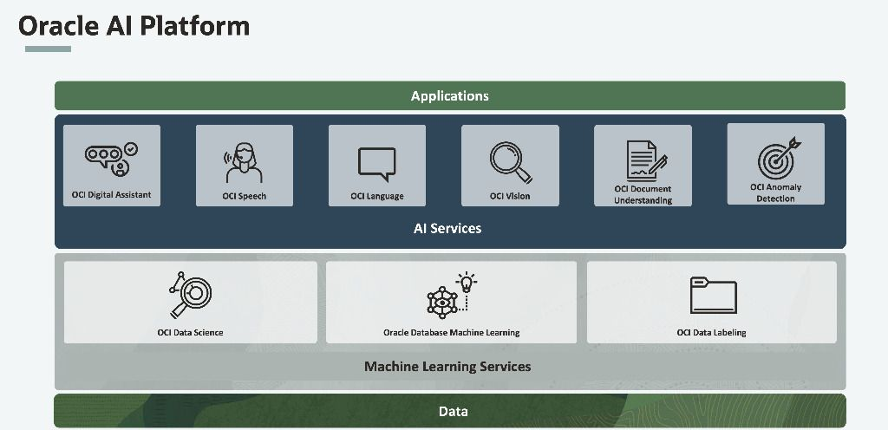
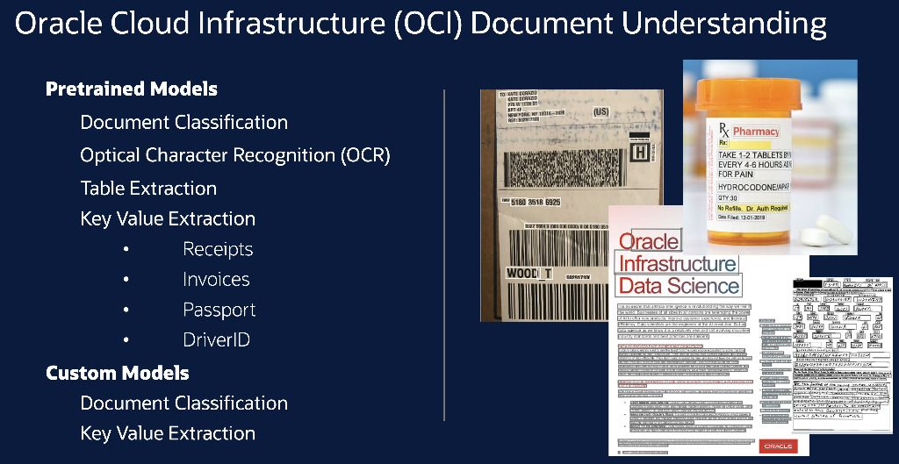
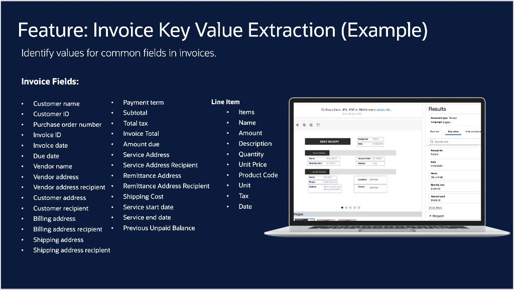
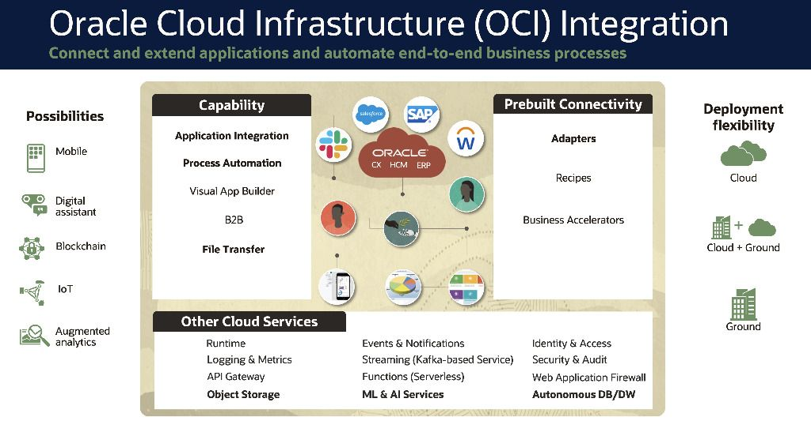
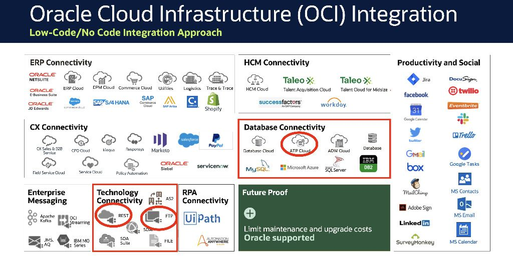

### Oracle AI Invoice Handling

#### Files for this lab

The project files for this lab are found in the [`/project` directory](https://github.com/oracle-devrel/oci-ai-invoice-handling/tree/main/project).

#### Video

#### Summary

So you’ve heard what our customers want – lets talk about what Oracle AI is all about. 

Oracle AI is basically what helps your applications make sense of your data, and apply AI to help you use your data in new ways. Whether it’s preparing your data with AI so you can drive better analytics experiences, or using AI on top your data to help make the right decisions and predictions for your business. 

Oracle AI is built on experience with industries. As the world’s leading enterprise applications provider with more than 80 apps ranging from the ERP suite to HCM to vertical offerings like Primavera and Opera, Oracle has gained experience from working with thousands of customers to discover how customers want to use AI to improve their processes and results. The industry experience represented by our apps informs our AI as we integrate it into those apps to benefit users.

Now you may already be familiar with our machine learning services – they have been around for a few years. The OCI Data Science offering provides you with a managed e2e environment for building, deploying and managing your machine learning models. Similarly, we have the Oracle Database Machine Learning, that offers you a complete data science environment that is optimized for performance in your Autonomous database or data warehouse. 

Today, we’re announcing a new services for data labeling, with a simple consistent experience making it easier to label your text or images and use those labels to customize your own machine learning models, and from there to build shared catalogs. 

But the heart of today's announcement is the the developers' layer- a comprehensive set of pretrained, plug-and-play Oracle AI services Lets go and dive into what’s new. 

And it provides two main capabilities: 
The first one is for analyzing images – both the “cat vs. dog” examples, but also for detecting objects and bounding boxes inside an image. You can bring your own labeled data, or use our data labeling service to create your own labeled data sets and train custom models. 

The second capability is around Document AI. You can use it to understand documents – whether it’s scanned PDFs, forms, or even images containing textual information. 
Extract Text The service can extract text from images, including non-trivial scenarios like Printed and handwritten text, Tilted shaded or rotated documents. It can also 
Document Classification classifies documents into different types based on visual appearance, high-level features, and extracted keywords. 
Language Detection analyzes the visual features of text to determine language - rather than relying on the text itself
Use table extraction to pull line-item detail from invoices, PO, receipts, and other similar documents
Obtain values for common fields in invoices and receipts using key value extraction

## License
Copyright (c) 2022 Oracle and/or its affiliates.

Licensed under the Universal Permissive License (UPL), Version 1.0.

See [LICENSE](LICENSE) for more details.

ORACLE AND ITS AFFILIATES DO NOT PROVIDE ANY WARRANTY WHATSOEVER, EXPRESS OR IMPLIED, FOR ANY SOFTWARE, MATERIAL OR CONTENT OF ANY KIND CONTAINED OR PRODUCED WITHIN THIS REPOSITORY, AND IN PARTICULAR SPECIFICALLY DISCLAIM ANY AND ALL IMPLIED WARRANTIES OF TITLE, NON-INFRINGEMENT, MERCHANTABILITY, AND FITNESS FOR A PARTICULAR PURPOSE.  FURTHERMORE, ORACLE AND ITS AFFILIATES DO NOT REPRESENT THAT ANY CUSTOMARY SECURITY REVIEW HAS BEEN PERFORMED WITH RESPECT TO ANY SOFTWARE, MATERIAL OR CONTENT CONTAINED OR PRODUCED WITHIN THIS REPOSITORY. IN ADDITION, AND WITHOUT LIMITING THE FOREGOING, THIRD PARTIES MAY HAVE POSTED SOFTWARE, MATERIAL OR CONTENT TO THIS REPOSITORY WITHOUT ANY REVIEW. USE AT YOUR OWN RISK. 
